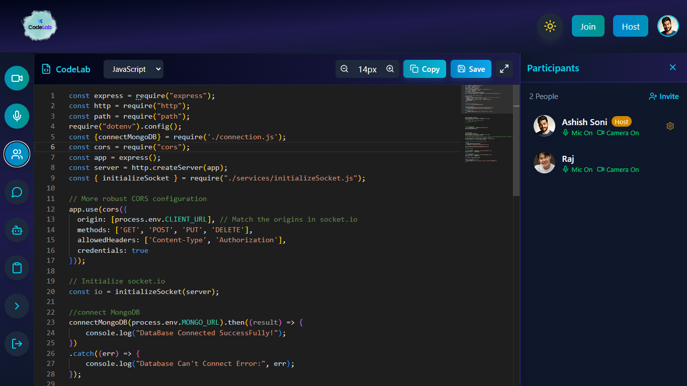
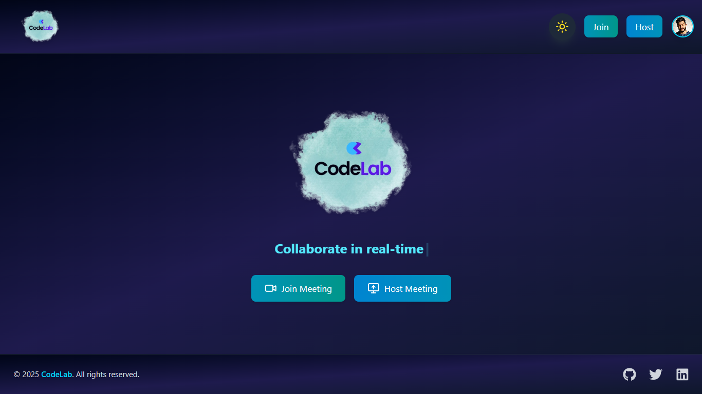
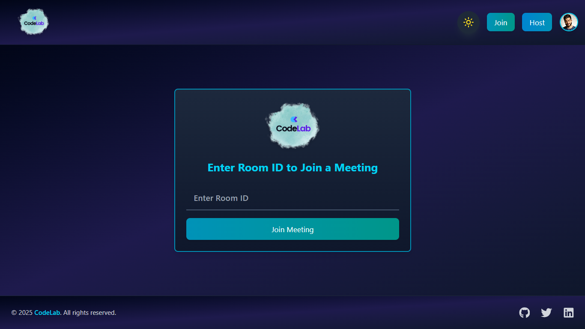
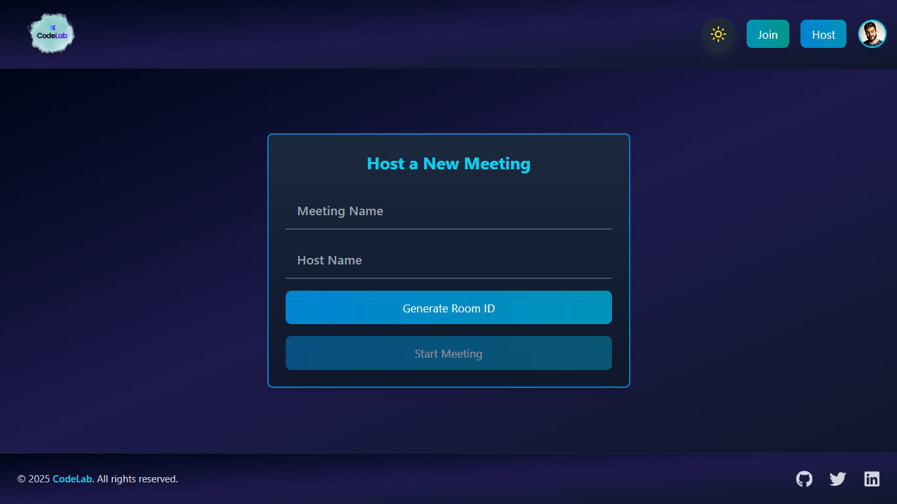
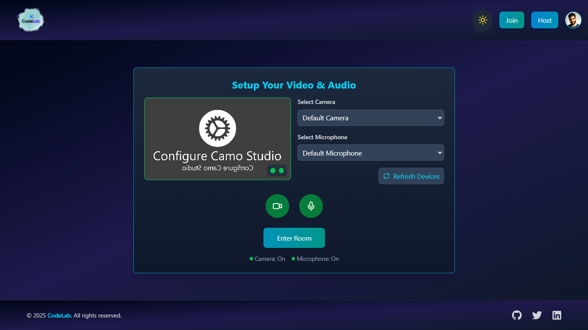
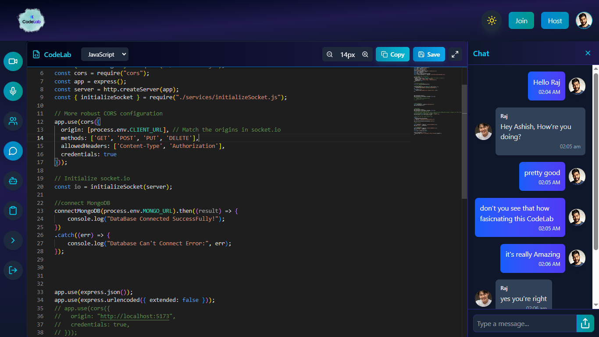
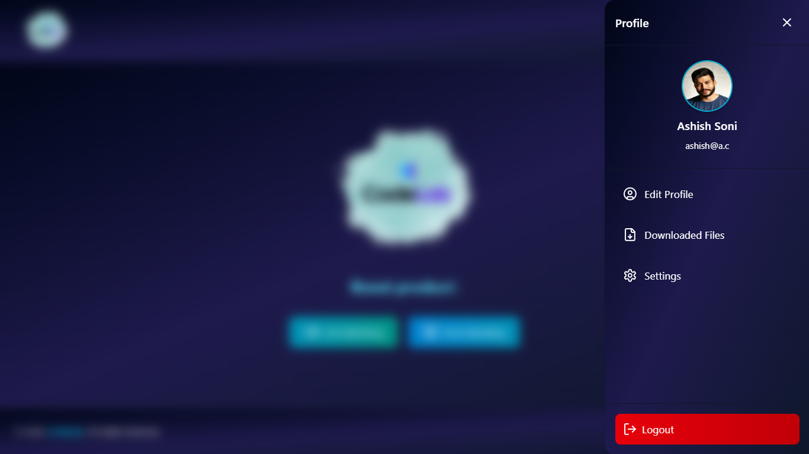

# 🚀 CodeLab - Real-Time Collaborative Code Editor

[](https://opensource.org/licenses/MIT)
[](https://github.com/ashishxsoni/CodeLab/stargazers)
[](https://github.com/ashishxsoni/CodeLab/network)
[](https://codelabb.netlify.app/join)

> A powerful real-time collaborative coding platform with integrated audio/video communication and AI-powered code review assistance.

## 🌟 Live Demo

**Try CodeLab now:** [https://codelabb.netlify.app/join](https://codelabb.netlify.app/join)



## 📸 Screenshots

<div align="center">

### 🏠 Home Page


### 🎯 Join a Room


### 🚀 Host a Room


### ⚙️ Room Setup


### 👥 Code Room - Real-time Collaboration


### 💬 Chat Integration


### 👤 User Profile


</div>

## 📋 Table of Contents

- [About](#about)
- [Key Features](#key-features)
- [Technologies Used](#technologies-used)
- [Getting Started](#getting-started)
- [Installation](#installation)
- [Usage](#usage)
- [Project Structure](#project-structure)
- [API Endpoints](#api-endpoints)
- [Contributing](#contributing)
- [License](#license)
- [Contact](#contact)

## 🎯 About

CodeLab is an innovative real-time collaborative code editor that revolutionizes how developers work together. It combines the power of live code collaboration with seamless audio/video communication and AI-powered code assistance, creating the perfect environment for pair programming, code reviews, and collaborative development sessions.

Whether you're conducting technical interviews, teaching programming concepts, or working on team projects, CodeLab provides all the tools you need in one integrated platform.

## ✨ Key Features

### 🔥 Real-Time Collaboration
- **Live Code Editing**: Multiple users can edit code simultaneously with real-time synchronization
- **Room-Based Sessions**: Create secure coding rooms with host controls
- **Permission Management**: Host can control who can edit and participate
- **Real-Time Cursor Tracking**: See where other participants are working in the code

### 📹 Audio/Video Integration
- **Built-in Video Conferencing**: High-quality video calls directly in the coding environment
- **Crystal Clear Audio**: Professional-grade audio communication
- **Screen Sharing**: Share your screen for better collaboration
- **Participant Management**: Mute/unmute participants and manage video feeds

### 🤖 AI-Powered Code Assistant
- **Smart Code Review**: AI-powered code analysis and suggestions
- **Doubt Resolution**: Ask questions about your code and get intelligent responses
- **Code Optimization**: Get recommendations for improving code quality and performance
- **Syntax Help**: Real-time assistance with programming syntax and best practices

### 🛡️ Security & Authentication
- **User Authentication**: Secure login and signup system
- **Authorized Access**: Only authenticated users can create and join rooms
- **Session Management**: Secure session handling with JWT tokens
- **Privacy Controls**: Host controls over room access and permissions

### 🎨 User Experience
- **Modern UI**: Clean, intuitive interface built with Tailwind CSS
- **Responsive Design**: Works seamlessly across desktop and mobile devices
- **Dark/Light Mode**: Toggle between themes for comfortable coding
- **Real-time Notifications**: Stay updated with participant actions and system events

## 🛠️ Technologies Used

### Frontend
- **React.js** - Modern UI library for building interactive interfaces
- **Vite** - Fast build tool and development server
- **Tailwind CSS** - Utility-first CSS framework for rapid styling
- **Redux** - State management for complex application state
- **WebSocket** - Real-time bidirectional communication
- **WebRTC** - Peer-to-peer audio/video communication

### Backend
- **Node.js** - JavaScript runtime for server-side development
- **Express.js** - Fast, unopinionated web framework
- **MongoDB** - NoSQL database for flexible data storage
- **Socket.io** - Real-time event-based communication
- **JWT** - Secure authentication tokens
- **Multer** - File upload middleware

### Development Tools
- **JavaScript (ES6+)** - Modern JavaScript features
- **HTML5 & CSS3** - Latest web standards
- **ESLint** - Code linting for consistent code quality
- **Git** - Version control system

## 🚀 Getting Started

### Prerequisites

Make sure you have the following installed:
- [Node.js](https://nodejs.org/) (v16.0 or higher)
- [MongoDB](https://www.mongodb.com/) (v4.0 or higher)
- [npm](https://www.npmjs.com/) or [yarn](https://yarnpkg.com/)
- [Git](https://git-scm.com/)

### Installation

1. **Clone the repository**
   ```bash
   git clone https://github.com/ashishxsoni/CodeLab.git
   cd CodeLab
   ```

2. **Set up the Backend**
   ```bash
   cd Backend
   npm install
   
   # Create environment file
   cp .env.sample .env
   # Edit .env with your configuration (MongoDB URI, JWT secret, etc.)
   
   # Start the backend server
   npm start
   ```

3. **Set up the Frontend**
   ```bash
   cd ../Frontend
   npm install
   
   # Create environment file
   cp .env.example .env
   # Configure your frontend environment variables
   
   # Start the development server
   npm run dev
   ```

4. **Access the application**
   - Frontend: `http://localhost:5173`
   - Backend API: `http://localhost:3000`

### Environment Variables

#### Backend (.env)
```env
MONGODB_URI=your_mongodb_connection_string
JWT_SECRET=your_jwt_secret_key
PORT=3000
NODE_ENV=development
```

#### Frontend (.env)
```env
VITE_API_URL=http://localhost:3000
VITE_SOCKET_URL=http://localhost:3000
```

## 💻 Usage

### Creating a Coding Session

1. **Sign Up/Login**: Create an account or login to your existing account
2. **Host a Room**: Click "Host a Room" to create a new coding session
3. **Share Room Link**: Copy and share the room link with participants
4. **Start Collaborating**: Begin coding together with real-time synchronization

### Joining a Session

1. **Get Room Link**: Receive the room link from the host
2. **Login**: Authenticate with your CodeLab account
3. **Join Room**: Enter the room and start collaborating
4. **Participate**: Write code, communicate via audio/video, and use AI assistance

### Using AI Code Assistant

1. **Ask Questions**: Use the AI prompt feature to ask coding-related questions
2. **Code Review**: Request AI analysis of your code for improvements
3. **Get Suggestions**: Receive intelligent recommendations for better code practices
4. **Debug Help**: Get assistance with debugging and error resolution

## 📁 Project Structure

```
CodeLab/
│
├── Backend/                    # Server-side application
│   ├── .env                   # Environment variables
│   ├── .env.sample           # Environment template
│   ├── connection.js         # Database connection
│   ├── server.js            # Main server file
│   ├── controllers/         # Request handlers
│   │   ├── login.js        # Authentication logic
│   │   ├── logout.js       # Logout functionality
│   │   ├── roomManager.js  # Room management
│   │   └── signup.js       # User registration
│   ├── middlewares/        # Custom middleware
│   │   ├── authentication.js
│   │   ├── AuthValidation.js
│   │   └── multerConfig.js
│   ├── models/            # Database schemas
│   │   └── user.js       # User model
│   ├── routes/           # API routes
│   │   ├── userRouter.js
│   │   └── roomRouter.js
│   └── services/         # Business logic services
│
└── Frontend/              # Client-side application
    ├── public/           # Static assets
    ├── src/
    │   ├── components/   # Reusable UI components
    │   │   ├── CodeEditor.jsx
    │   │   ├── ChatMessages.jsx
    │   │   ├── ControlBar.jsx
    │   │   ├── ParticipantsList.jsx
    │   │   └── ... (other components)
    │   ├── pages/        # Application pages
    │   │   ├── HomePage.jsx
    │   │   ├── RoomPage.jsx
    │   │   ├── LoginPage.jsx
    │   │   └── ... (other pages)
    │   ├── redux/        # State management
    │   │   ├── store.jsx
    │   │   ├── authSlice.jsx
    │   │   └── themeSlice.jsx
    │   └── utils/        # Utility functions
    └── package.json
```

## 🔌 API Endpoints

### Authentication
- `POST /api/auth/signup` - User registration
- `POST /api/auth/login` - User login
- `POST /api/auth/logout` - User logout

### Room Management
- `POST /api/room/create` - Create a new coding room
- `GET /api/room/:roomId` - Get room details
- `POST /api/room/:roomId/join` - Join a room
- `DELETE /api/room/:roomId` - Delete a room (host only)

### WebSocket Events
- `join-room` - Join a coding room
- `code-change` - Real-time code synchronization
- `cursor-position` - Share cursor positions
- `user-joined` - Notify when user joins
- `user-left` - Notify when user leaves

## 🤝 Contributing

We welcome contributions from the community! Here's how you can help:

1. **Fork the repository**
2. **Create a feature branch**
   ```bash
   git checkout -b feature/amazing-feature
   ```
3. **Make your changes**
   - Follow the existing code style
   - Add tests for new features
   - Update documentation as needed
4. **Commit your changes**
   ```bash
   git commit -m 'Add some amazing feature'
   ```
5. **Push to the branch**
   ```bash
   git push origin feature/amazing-feature
   ```
6. **Open a Pull Request**

### Development Guidelines

- Follow JavaScript ES6+ standards
- Use meaningful commit messages
- Write clean, documented code
- Test your changes thoroughly
- Ensure responsive design principles

## 📝 License

This project is licensed under the MIT License - see the [LICENSE](LICENSE) file for details.

## 👨‍💻 Contact

**Ashish Soni**
- GitHub: [@ashishxsoni](https://github.com/ashishxsoni)
- Email: ashishxsoni@gmail.com
- LinkedIn: [Connect with me](https://linkedin.com/in/ashishxsoni)

## 🙏 Acknowledgments

- Thanks to the open-source community for the amazing tools and libraries
- Inspired by modern collaborative development practices
- Special thanks to all contributors and users who make CodeLab better

## 🌟 Show Your Support

If you found CodeLab helpful, please consider:
- ⭐ Starring the repository
- 🐛 Reporting bugs and issues
- 💡 Suggesting new features
- 🤝 Contributing to the codebase

---

**Made with ❤️ by [Ashish Soni](https://github.com/ashishxsoni)**

*Empowering developers to collaborate better, one line of code at a time.*